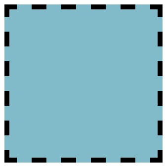

-   Create a HTML page called *box.html* using this template:

~~~~~~~~~~~~~~~~~~~~~~~~~~~~~~~~~~~~~~~~~~~~~~~~~~~~~~~~~~~~~~~~~~~~~~~~~~~~~~~~
<!DOCTYPE html>
<html lang="en">
    <head>
        <meta charset="UTF-8">
        <title>Box Model</title>
        
    </head>
    <body>
        

    </body>
</html>
~~~~~~~~~~~~~~~~~~~~~~~~~~~~~~~~~~~~~~~~~~~~~~~~~~~~~~~~~~~~~~~~~~~~~~~~~~~~~~~~

 

-   Inside the `<head>` and between the `<style>` tags, create a CSS class
    named `box` with the following CSS rules:

~~~~~~~~~~~~~~~~~~~~~~~~~~~~~~~~~~~~~~~~~~~~~~~~~~~~~~~~~~~~~~~~~~~~~~~~~~~~~~~~
.box{
        width:300px;   
        height: 300px;
        background-color:#81BBC9;
        margin: 50px;
        border: 10px dashed #000;
}
~~~~~~~~~~~~~~~~~~~~~~~~~~~~~~~~~~~~~~~~~~~~~~~~~~~~~~~~~~~~~~~~~~~~~~~~~~~~~~~~

 

-   In the html, give the `
` the class name of `box`.

-   Open the HTML page in your browser.

-   Modify all the values of the code and see how it affects the expected
    output.

 

Did you get the following result?

